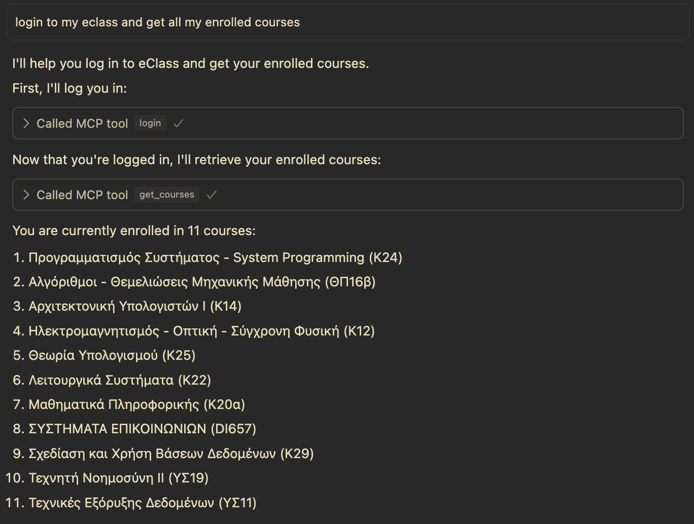
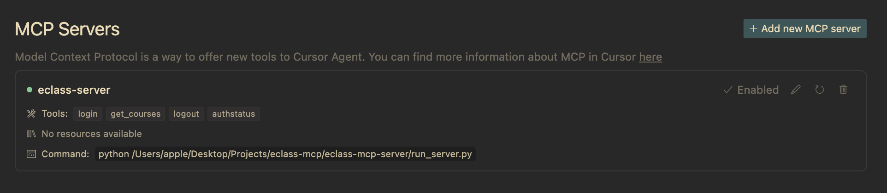

# eClass MCP Server

<p align="center">
    <strong>An MCP server for interacting with Open eClass platform instances, with specific support for UoA's SSO authentication system.</strong>
</p>

<p align="center">
    <a href="https://github.com/modelcontextprotocol/python-sdk"></a>
    <a href="https://www.gnu.org/licenses/gpl-3.0"></a>
    
    
    <a href="https://github.com/gunet/openeclass"></a>
</p>

<p align="center">
    <a href="https://glama.ai/mcp/servers/@sdi2200262/eclass-mcp-server">
      
    </a>
</p>

<p align="center">
    
</p>

<p align="center">
    <strong>This server enables AI agents to authenticate with eClass, retrieve course information, and perform basic operations on the platform.</strong>
</p>

## Features

- **Authentication**: Log in to eClass through UoA's CAS SSO authentication system
- **Course Management**: Retrieve lists of enrolled courses
- **Session Management**: Maintain authenticated sessions between tool calls
- **Status Checking**: Verify authentication status

## Project Structure

This project follows a modular architecture for better maintainability:

```
eclass-mcp-server/
├── run_server.py               # Entry point script for running the server
├── eclass_client.py            # Standalone client for eClass (non-MCP)
├── pyproject.toml              # Project configuration and dependencies
├── .env                        # Environment variables (create from example.env)
├── docs/                       # Documentation
│   ├── README.md               # Documentation overview
│   ├── how-it-works.md         # Core implementation explanation
│   ├── mcp-sdk-integration.md  # Details on MCP SDK usage
│   └── tools-reference.md      # Reference for available tools
├── src/
    └── eclass_mcp_server/      # Main package
        ├── __init__.py         # Package initialization
        ├── server.py           # Core server implementation and tool handlers
        ├── authentication.py   # Authentication functionality 
        ├── course_management.py # Course-related functionality
        ├── html_parsing.py     # HTML parsing utilities
        └── test/               # Test scripts for functionality verification
            ├── __init__.py
            ├── test_login.py
            ├── test_courses.py
            └── run_all_tests.py
```

## Installation

Install the server using UV (recommended):

```bash
# Clone the repository
git clone https://github.com/yourusername/eClass-MCP-server.git
cd eClass-MCP-server

# Install dependencies
uv sync --dev --all-extras
```

Alternatively, install with pip:

```bash
pip install -e .
```

## Configuration

Create a `.env` file in the root directory with the following configuration (or copy and rename the provided `example.env` file):

```
ECLASS_URL=https://eclass.uoa.gr
ECLASS_USERNAME=your_username
ECLASS_PASSWORD=your_password
```

All credentials must be provided in the .env file. The server does not accept credentials as parameters.

## Usage

### Terminal
Run the server using the entry point script:

```bash
python run_server.py
```

Or as a module:

```bash
python -m src.eclass_mcp_server.server
```

### Cursor
( as of version 0.48 )
Go to Settings -> MCP. Click on `Add new global MCP server`:

This will open the global `mcp.json` file:
```
{
    "mcpServers": {
      "server-name": {
        "command": "python",
        "args": ["absolute\\path\\to\\eclass-mcp-server\\run_server.py"]
      }
    }
}
```

Or try this path format on the `args` field:
```
absolute/path/to/eclass-mcp-server/run_server.py
```

This command runs the `run_server.py` script that connects the MCP Client with the main server entry point in `server.py`.

<p align="center">
    
</p>

### Claude Desktop

To use with Claude Desktop:

1. Open Claude Desktop
2. Go to Settings > Server
3. Add a new server with the following details:
   - Name: eClass MCP
   - Command: Path to your run_server.py script
4. Click Add Server
5. Select the server from the dropdown when chatting with Claude

## Tools
The server provides the following tools for use with MCP clients:

### login

Log in to eClass using SSO authentication.

```json
{
  "random_string": "any_value"
}
```

### get_courses

Retrieve a list of enrolled courses (requires login first).

```json
{
  "random_string": "any_value"
}
```

### logout

Log out from eClass.

```json
{
  "random_string": "any_value"
}
```

### authstatus

Check the current authentication status.

```json
{
  "random_string": "any_value"
}
```

## eClass Client (Non-MCP)

The repository includes `eclass_client.py`, a standalone client for interacting with the eClass platform. This was the initial implementation that inspired the creation of the MCP server.

### Features of eClass Client

- Pure Python implementation without MCP integration
- Handles the complete authentication flow with UoA's SSO system
- Retrieves course information from eClass
- Provides clean logout functionality

This client serves as both:
1. A reference implementation for understanding the eClass authentication flow
2. A simpler alternative for projects that don't require MCP integration

You can run the client directly:

```bash
python eclass_client.py
```

## Testing

The project includes test scripts to verify functionality:

```bash
# Run all tests
python -m src.eclass_mcp_server.test.run_all_tests

# Run specific tests
python -m src.eclass_mcp_server.test.test_login
python -m src.eclass_mcp_server.test.test_courses
```

## Documentation

Comprehensive documentation is available in the `docs/` directory:

- [Documentation Overview](docs/README.md)
- [How It Works](docs/how-it-works.md)
- [MCP SDK Integration](docs/mcp-sdk-integration.md)
- [Tools Reference](docs/tools-reference.md)

## Example MCP Client Usage

```python
from mcp import ClientSession, StdioServerParameters
from mcp.client.stdio import stdio_client
import asyncio

async def run_agent():
    server_params = StdioServerParameters(
        command="python /path/to/eclass-mcp-server/run_server.py",
    )
    
    async with stdio_client(server_params) as (read, write):
        async with ClientSession(read, write) as session:
            # Initialize the session
            await session.initialize()
            
            # Login to eClass
            login_result = await session.call_tool("login", {
                "random_string": "dummy"
            })
            print(login_result)
            
            # Get courses
            courses_result = await session.call_tool("get_courses", {
                "random_string": "dummy"
            })
            print(courses_result)
            
            # Logout
            logout_result = await session.call_tool("logout", {
                "random_string": "dummy"
            })
            print(logout_result)

if __name__ == "__main__":
    asyncio.run(run_agent())
```

## Integration with AI Agents

This MCP server is designed to be used with AI agents that support the Model Context Protocol. This enables AI systems to interact with eClass directly, allowing for capabilities like:

- Retrieving course information
- Checking course announcements
- Accessing course materials
- Submitting assignments (future feature)

## Security

The eClass MCP Server is designed with security as a top priority, particularly regarding credential handling:

### Local-Only Execution

- **No Cloud Services**: The MCP server runs entirely on your local machine, with no cloud components
- **No Remote Storage**: Credentials and session data never leave your local environment
- **User-Controlled**: You maintain complete control over your authentication data

### Credential Protection

- **Environment Variables Only**: Credentials are stored exclusively in the local `.env` file
- **Never Passed as Parameters**: All tools are designed to use dummy parameters (e.g., `random_string`) 
- **AI Client Isolation**: AI clients (like Claude or other LLMs) never receive your credentials
  - This prevents credentials from being:
    - Stored in AI provider logs
    - Included in model training data
    - Processed on remote servers

### Session Management

- **In-Memory Sessions**: Session cookies and state are maintained only in memory
- **No Persistence**: Session data is not stored between runs
- **Direct Authentication**: The MCP server communicates directly with eClass, with no intermediaries, apart from your University's CAS mechanism.

### Recommended Practices

- Store your `.env` file securely and never commit it to version control
- Run the server only on trusted machines
- Dont pass the parameters to an MCP client through any prompts, they will not be used by the Server and will be accessed by the AI Agent provider

## License

### GNU General Public License v3.0

This project is licensed under the GNU General Public License v3.0 - see the [LICENSE](LICENSE) file for details.

#### What this means for you

The GPL-3.0 license is a strong copyleft license that requires anyone who distributes this code or derivative works to make the source code available under the same terms. Key points:

- **Freedom to use**: You can use this software for any purpose
- **Freedom to study**: You can examine the source code to see how it works
- **Freedom to share**: You can redistribute the software
- **Freedom to modify**: You can adapt the software to your needs

#### Why we chose GPL-3.0

We chose the GPL-3.0 license to:

1. **Protect user security**: Ensures that any modifications handling credentials must be open source, allowing users to verify security implementations
2. **Promote sharing**: Encourages contributions back to the community
3. **Prevent abuse**: Makes it harder for malicious actors to create closed-source derivatives that might compromise security
4. **Match ecosystem values**: Aligns with the values of the Open eClass platform, which is also open source

This license is particularly important for this software since it handles authentication and sensitive credentials. The GPL-3.0 ensures that any modifications to this code remain transparent, allowing users to verify how their credentials are being handled.

## Acknowledgments

- [GUnet (Greek Universities Network)](https://github.com/gunet) for developing and maintaining the [Open eClass platform](https://github.com/gunet/openeclass), an open-source learning management system used by academic institutions throughout Greece.
- The Open eClass platform is distributed as free Open Source Software under GNU GPL v2.0, making projects like this MCP integration possible.
- Special thanks to the Asynchronous eLearning Team of GUnet for their continuous development and improvement of the eClass platform.
- This project is an independent interface to the Open eClass system and is not affiliated with or endorsed by GUnet. It respects the Terms of Service of the eClass platform and uses proper authentication mechanisms.

## Contributing

Contributions are welcome! Please feel free to submit a Pull Request.
