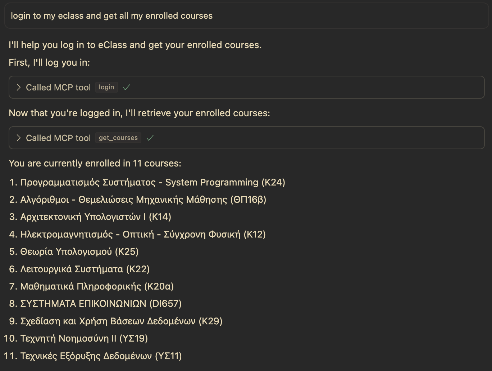

# eClass MCP Server

An MCP server for interacting with the [Open eClass](https://github.com/gunet/openeclass) platform, with support for UoA's SSO authentication.

<p align="center">
    <a href="https://github.com/modelcontextprotocol/python-sdk"></a>
    <a href="https://www.gnu.org/licenses/gpl-3.0"></a>
    
</p>

<p align="center">
    
</p>

## Features

- **SSO Authentication**: Log in through UoA's CAS SSO system
- **Course Retrieval**: Get list of enrolled courses
- **Session Management**: Persistent sessions between tool calls
- **Status Checking**: Verify authentication status

## Quick Start

### Prerequisites

- Python 3.10+
- [uv](https://github.com/astral-sh/uv) (recommended) or pip

### Installation

```bash
git clone https://github.com/sdi2200262/eclass-mcp-server.git
cd eclass-mcp-server
uv sync --dev --all-extras
```

### Configuration

Create a `.env` file (or copy `example.env`):

```bash
ECLASS_USERNAME=your_username
ECLASS_PASSWORD=your_password
```

Optional settings:
```bash
ECLASS_URL=https://eclass.uoa.gr          # Default
ECLASS_SSO_DOMAIN=sso.uoa.gr              # Default
ECLASS_SSO_PROTOCOL=https                 # Default
```

### Running

```bash
# Using the entry point script
python run_server.py

# Or as a module
python -m src.eclass_mcp_server.server
```

## MCP Client Configuration

To use this MCP server with Claude Desktop, VS Code, Cursor, or any MCP-compatible client, configure your client to run:

```bash
python3 /absolute/path/to/eclass-mcp-server/run_server.py
```

Set the following environment variables in your client's MCP configuration:

```json
{
  "env": {
    "ECLASS_USERNAME": "your_username",
    "ECLASS_PASSWORD": "your_password"
  }
}
```

**Optional environment variables:**
- `ECLASS_URL` - OpenEclass instance URL (default: `https://eclass.uoa.gr`)
- `ECLASS_SSO_DOMAIN` - SSO domain (default: `sso.uoa.gr`)
- `ECLASS_SSO_PROTOCOL` - SSO protocol (default: `https`)

Refer to your specific client's documentation for how to add MCP servers to your configuration.

## Available Tools

| Tool | Description |
|------|-------------|
| `login` | Authenticate using credentials from `.env` |
| `get_courses` | Retrieve enrolled courses (requires login) |
| `logout` | End the current session |
| `authstatus` | Check authentication status |

All tools use a dummy `random_string` parameter (MCP protocol requirement).

## Standalone Client

For non-MCP usage, a standalone client is included:

```bash
python eclass_client.py
```

This demonstrates the core functionality without MCP integration. See [docs/architecture.md](docs/architecture.md) for details.

## Documentation

- [Architecture](docs/architecture.md) - System design and authentication flow
- [Wire Protocol](docs/reference/wire-protocol.md) - JSON-RPC message formats
- [Tools Reference](docs/reference/tools-reference.md) - Detailed tool documentation

## Project Structure

```
eclass-mcp-server/
├── run_server.py               # Entry point
├── eclass_client.py            # Standalone client (non-MCP)
├── src/eclass_mcp_server/      # Main package
│   ├── server.py               # MCP server and tool handlers
│   ├── authentication.py       # SSO authentication
│   ├── course_management.py    # Course operations
│   ├── html_parsing.py         # HTML parsing utilities
│   └── test/                   # Test scripts
└── docs/                       # Documentation
```

## Security

- Credentials are stored locally in `.env` only
- Never passed as tool parameters (preventing AI provider exposure)
- Sessions maintained in-memory only
- No cloud services or remote storage

## License

[GNU GPL v3.0](LICENSE) - This ensures transparency in credential handling.

## Acknowledgments

- [GUnet](https://github.com/gunet) for the [Open eClass platform](https://github.com/gunet/openeclass)
- This project is an independent interface, not affiliated with GUnet
